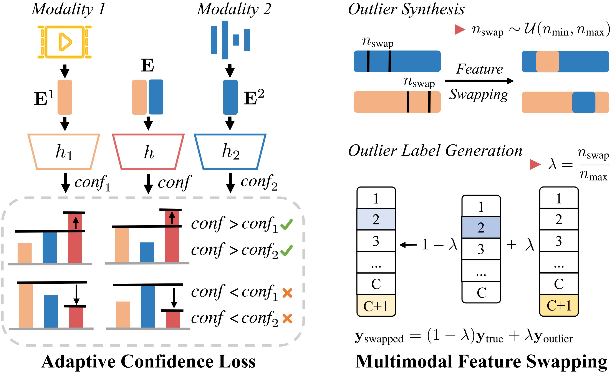

<div align="center">

<h1>Adaptive Confidence Regularization for Multimodal Failure Detection</h1>

<p>
    <a href='https://scholar.google.com/citations?user=ihVItz4AAAAJ&hl=en' target='_blank'>Moru Liu</a><sup>1</sup>&emsp;
    <a href='https://scholar.google.com/citations?user=5jcoGEIAAAAJ&hl=en' target='_blank'>Hao Dong</a><sup>2</sup>&emsp;
    <a href='https://scholar.google.com/citations?user=eAcIoUgAAAAJ&hl=en' target='_blank'>Olga Fink</a><sup>3</sup>&emsp;
    <a href='https://scholar.google.com/citations?user=BljrdnEAAAAJ&hl=en' target='_blank'>Mario Trapp</a><sup>1,4</sup>
</p>

<p>
    <sup>1</sup> Technical University of Munich &emsp; 
    <sup>2</sup> ETH Zurich &emsp; 
    <sup>3</sup> EPFL &emsp; 
    <sup>4</sup> Fraunhofer IKS
</p>

<h4>
    <a href="https://openaccess.thecvf.com/content/CVPR2026/papers/Liu_Adaptive_Confidence_Regularization_for_Multimodal_Failure_Detection_CVPR_2026_paper.pdf" target='_blank'>[CVPR 2026 Paper]</a>
</h4>



<br><br>

<p>
Deploying multimodal models in high-stakes domains demands strong predictive performance and reliable failure detection. This repository provides the implementation of ACR, which improves overall reliability through two key mechanisms:
</p>

<ul style="display: inline-block; text-align: left; max-width: 800px;">
    <li><b>Adaptive Confidence Loss:</b> Penalizes <i>confidence degradation</i> during training to ensure the multimodal branch remains as confident as its strongest unimodal counterpart.</li>
    <li><b>Multimodal Feature Swapping:</b> A novel outlier synthesis technique that generates failure-aware training examples, allowing the model to better recognize and reject uncertain predictions.</li>
</ul>

</div>

---

## 🛠 Installation

### Environment

We recommend creating a fresh conda environment. The code is tested with **Python 3.10**, **PyTorch 1.10**, **CUDA 11.3**, and **mmaction2 v0.13.0**.


### Pretrained Backbones

We use the SlowFast (R101) and SlowOnly (R50) backbones pretrained on Kinetics-400, both released by [mmaction2](https://github.com/open-mmlab/mmaction2), along with a VGGSound audio backbone. Download them once and place them under `HMDB-rgb-flow/pretrained_models/` and `EPIC-rgb-flow/pretrained_models/`:

```bash
# RGB backbone (SlowFast R101, ~265 MB)
wget https://download.openmmlab.com/mmaction/recognition/slowfast/slowfast_r101_8x8x1_256e_kinetics400_rgb/slowfast_r101_8x8x1_256e_kinetics400_rgb_20210218-0dd54025.pth

# Flow backbone (SlowOnly R50, ~135 MB)
wget https://download.openmmlab.com/mmaction/recognition/slowonly/slowonly_r50_8x8x1_256e_kinetics400_flow/slowonly_r50_8x8x1_256e_kinetics400_flow_20200704-6b384243.pth

# Audio backbone (VGGSound)
wget http://www.robots.ox.ac.uk/~vgg/data/vggsound/models/H.pth.tar -O HMDB-rgb-flow/pretrained_models/vggsound_avgpool.pth.tar

ln -s ../../HMDB-rgb-flow/pretrained_models/vggsound_avgpool.pth.tar EPIC-rgb-flow/pretrained_models/vggsound_avgpool.pth.tar
```

## 📂 Datasets

We follow the data layout used in [FeatureMixing](https://github.com/mona4399/FeatureMixing), [MultiOOD](https://github.com/donghao51/MultiOOD) and [SimMMDG](https://github.com/donghao51/SimMMDG). If you have one of these prepared, ACR runs directly on the same folders. If not, please follow [MultiOOD](https://github.com/donghao51/MultiOOD#dataset-preparation) for dataset download and preparation.

## 🏃 Training

### HMDB51

```bash
cd HMDB-rgb-flow
python train_video_flow.py \ 
    --dataset 'HMDB' --mfs_max 256 \
    --lr 1e-4 --bsz 16 --nepochs 50 --num_workers 10 --seed 0 \
    --use_single_pred \ 
    --save_best --save_checkpoint --datapath '/path/to/HMDB51/'

```

### EPIC-Kitchens

```bash
cd EPIC-rgb-flow
python train_video_flow.py \ 
    --dataset 'EPIC' \
    --lr 1e-4 --bsz 16 --nepochs 20 --num_workers 10 --seed 0 \
    --use_single_pred \ 
    --save_best --save_checkpoint --datapath '/path/to/EPIC-KITCHENS/'

```

### HAC

```bash
cd HMDB-rgb-flow
python train_video_flow.py \ 
    --dataset 'HAC' \
    --lr 1e-4 --bsz 16 --nepochs 30 --num_workers 10 --seed 0 \
    --use_single_pred \ 
    --save_best --save_checkpoint --datapath '/path/to/HAC/'

```

## Kinetics100

```bash
cd HMDB-rgb-flow
python train_video_flow.py \ 
    --dataset 'Kinetics100' \
    --lr 1e-4 --bsz 16 --nepochs 50 --num_workers 10 --seed 0 \
    --use_single_pred \ 
    --save_best --save_checkpoint --datapath '/path/to/Kinetics100/'

```

## 📊 Evaluation

We support six confidence-score variants out of the box: `msp`, `energy`, `max-logit`, `entropy`, `var`, and `doctor` (see [Granese et al., NeurIPS 2021](https://arxiv.org/abs/2106.02395)).

### HMDB51

```bash
cd HMDB-rgb-flow
python test_video_flow.py \
    --dataset 'HMDB' --datapath /path/to/HMDB51/ \
    --bsz 16 --num_workers 2 \
    --score msp \
    --resumef models/acr_hmdb_best.pt

```

*Tip: Switch `--score` to `energy`, `max-logit`, `entropy`, `var`, or `doctor` to reproduce the other rows of the results table.*


## 📖 Citation

If you find this work useful, please cite:

```bibtex
@inproceedings{liu2026adaptive,
  title={Adaptive Confidence Regularization for Multimodal Failure Detection},
  author={Liu, Moru and Dong, Hao and Fink, Olga and Trapp, Mario},
  booktitle={Proceedings of the IEEE/CVF Conference on Computer Vision and Pattern Recognition},
  pages={15850--15859},
  year={2026}
}

```

## 🔗 Related Projects

* [FeatureMixing](https://github.com/mona4399/FeatureMixing) — Extremely Simple Multimodal Outlier Synthesis for OOD Detection and Segmentation (NeurIPS 2025)
* [MultiOOD](https://github.com/donghao51/MultiOOD) — Scaling Out-of-Distribution Detection for Multiple Modalities
* [SimMMDG](https://github.com/donghao51/SimMMDG) — A Simple and Effective Framework for Multimodal Domain Generalization

## 🙏 Acknowledgements

This codebase builds on the excellent open-source work of [mmaction2](https://github.com/open-mmlab/mmaction2), [MultiOOD](https://github.com/donghao51/MultiOOD), and [SimMMDG](https://github.com/donghao51/SimMMDG). We thank the authors for making their code and data available.


